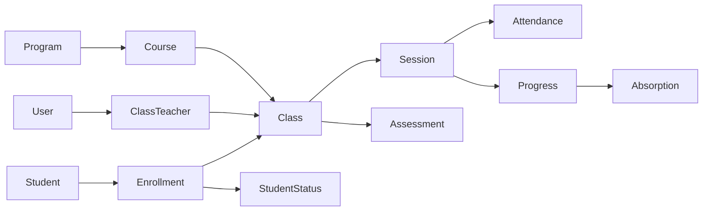

# AGENTS.md — LMS Sáng Tạo Xanh

Handbook cho agent khi sửa LMS. Không thay [docs/USER_GUIDE.md](docs/USER_GUIDE.md) (hướng dẫn người dùng) hay [.cursor/rules/lms-auto-codes.mdc](../.cursor/rules/lms-auto-codes.mdc) (rule mã tự sinh).

---

## 1. Ranh giới sản phẩm

- LMS **nội bộ** Sáng Tạo Xanh — tách website public/CMS.
- User/bảng riêng: `lms_users`, `lms_*`; guard Laravel `auth:lms`; API `/api/v1/lms`.
- **FE:** Next.js App Router trong repo này (dev port `3001`). Client duy nhất: [`src/lib/api.ts`](src/lib/api.ts) (`lmsApi`).
- **BE:** Laravel [`../green-creative-be/backend/app/Lms`](../green-creative-be/backend/app/Lms), routes [`../green-creative-be/backend/routes/v1/lms.php`](../green-creative-be/backend/routes/v1/lms.php).
- **Không có:** billing, portal phụ huynh, nộp bài tập, export Excel, chat (chỉ field `zalo_url` trên lớp nếu có).

---

## 2. Mô hình miền

### Invariants (bắt buộc giữ)

| Rule | Chi tiết |
|------|----------|
| Master student | HV là hồ sơ dùng chung nhiều lớp; thuộc lớp qua **enrollment**. |
| Status theo enrollment | `status_id` gắn enrollment, **không** gắn master student. |
| Không enroll trùng | Cùng HV không được enroll hai lần trong một lớp (soft-delete có thể restore). |
| Lớp khóa | `inactive` / `ended` → `is_locked`: không sửa nội dung, không enroll / điểm danh / tiến độ / đánh giá. |
| Sĩ số | Min 5 (cảnh báo `below_min_size`); max **15** enrollment active (không `dropped`) — BE enforce. |
| Mã tự sinh | Class / catalog `code` do server sinh; **immutable** khi update. Chi tiết: `lms-auto-codes.mdc`. Class: `{course_slug}-{NN}` qua `LmsCodeGenerator::nextClassCode`. |

---

## 3. Vai trò & quyền

### Role & status

| | Giá trị |
|---|---|
| Role | `admin` \| `teacher` (`null` khi pending) |
| User status | `pending` → `approved` \| `disabled` |
| Pivot lớp (`lms_class_teachers.role`) | `teacher` \| `ta` |

- **Teacher:** chỉ lớp được gán; **không** tự tạo lớp (chỉ Admin). Tab **Lớp học** + sửa metadata / kết thúc lớp cần flag `manage_classes`.
- **Admin:** mọi lớp; tạo lớp + gán giáo viên; toàn quyền teacher + users / stats / import / duyệt hồ sơ.

### Catalog permissions (`CatalogPermissions`)

Flags trên teacher (Admin luôn `true`):

| Flag | Quyền |
|------|--------|
| `manage_programs` | CRUD chương trình |
| `manage_courses` | CRUD khóa học |
| `manage_students` | CRUD master HV + thêm HV mới khi enroll |
| `manage_student_statuses` | CRUD trạng thái HV |
| `manage_absorption_levels` | CRUD mức tiếp thu |
| `manage_classes` | Hiện tab Lớp học; sửa metadata + kết thúc lớp đã gán (không tạo lớp) |

- Đọc catalog (dropdown): mọi user đã đăng nhập.
- CRUD catalog: theo flag. Gán tại [`CatalogPermissionEditor.tsx`](src/components/catalogs/CatalogPermissionEditor.tsx) / `PUT /lms/users/{id}/catalog-permissions`.
- `manage_classes` **không** mở tab Danh mục (`catalogTabs.ts`).
- Types: [`src/types/lms.ts`](src/types/lms.ts). Tab visibility: [`catalogTabs.ts`](src/components/catalogs/catalogTabs.ts) + AppShell (Lớp học theo `manage_classes`).

### Admin-only

Users, stats, import Excel, **tạo lớp + gán GV**, xóa lớp, đổi status lớp (dropdown), duyệt change-request hồ sơ GV, thu hồi thông báo bất kỳ lúc nào.

---

## 4. Nav hiện tại (`AppShell.tsx`)

Nguồn thật: [`src/components/AppShell.tsx`](src/components/AppShell.tsx). USER_GUIDE có thể lệch — ưu tiên nav code.

| Nhóm | Routes |
|------|--------|
| Teacher | `/dashboard`, `/classes`, `/attendance`, `/progress` (label: **Tiến độ & Đánh giá**), `/students` (label: **Học viên & Tra cứu**) |
| Conditional | `/catalogs` nếu admin hoặc ≥1 catalog flag |
| Admin | `/users`, `/stats`, `/import` |
| Bottom | `/announcements`, `/profile` |
| Không sidebar | `/assessments` (có page), `/reports` (header search), `/classes/[id]`, `/users/[id]`, `/forbidden` |

---

## 5. Nghiệp vụ theo module

Mỗi mục: luồng ngắn + invariant + file chính. Chi tiết UI → USER_GUIDE.

### 5.1 Auth / onboard

Lookup email → login / set-password / request-access / pending / disabled.  
401 → sign-out về `/login`. 403 → `/forbidden` (giữ session).  
FE: [`src/auth.ts`](src/auth.ts), [`(auth)/login`](src/app/(auth)/login/page.tsx).  
BE: `AuthController`.

### 5.2 Danh mục

Program → Course; StudentStatus (system: `active` / `reserved` / `dropped`); AbsorptionLevel.  
`is_system` không xóa; soft-disable `is_active`. Code auto, không sửa sau tạo.  
FE: [`/catalogs`](src/app/(app)/catalogs/page.tsx), hook [`useCatalog.ts`](src/hooks/useCatalog.ts).  
BE: `CatalogController`.

### 5.3 Lớp học

Tạo lớp → **chỉ Admin** (bắt buộc `teachers[]` ≥ 1). GV có `manage_classes`: sửa metadata + `POST .../end` trên lớp đã gán (unlocked). Chỉ Admin: `PUT .../status`, `DELETE`, sync `teachers`.  
`days[]` (0–6) materialize buổi điểm danh theo tháng. Code: `{course_slug}-{NN}`; không gửi `code` từ FE create.  
FE: [`/classes`](src/app/(app)/classes/page.tsx), [`/classes/[id]`](src/app/(app)/classes/[id]/page.tsx).  
BE: `ClassController` + `ClassAccessService` (`assertCanManageClassMeta`).

### 5.4 Học viên + enrollment

Master CRUD cần `manage_students` (Admin luôn được). Teacher chỉ thấy HV trong lớp mình.  
Trong lớp: enroll HV có sẵn **hoặc** tạo HV mới (cần `manage_students`). Default status enrollment = `active`.  
FE: [`/students`](src/app/(app)/students/page.tsx), class detail.  
BE: `StudentController`, `EnrollmentController`.

### 5.5 Điểm danh

Grid lớp + tháng/năm; session auto từ `days[]`. Chấm: `present` / `excused` / `unexcused` (null = xóa ô).  
Tỷ lệ có mặt = present / ô **đã chấm** (ô trống không tính).  
FE: [`/attendance`](src/app/(app)/attendance/page.tsx). BE: `AttendanceController`.

### 5.6 Tiến độ học

Theo buổi (cùng session điểm danh): BTVN `done` / `missing` + mức tiếp thu (catalog).  
FE: [`/progress`](src/app/(app)/progress/page.tsx). BE: `ProgressController`.

### 5.7 Đánh giá (mid / final)

Unique: `class + student + year + month + period` (`mid` \| `final`).  
Điểm: in_class, homework, L/S/R/W + nhận xét.  
FE: [`/assessments`](src/app/(app)/assessments/page.tsx) — **có route, không có mục sidebar** (nav “Tiến độ & Đánh giá” chỉ trỏ `/progress`).  
BE: `AssessmentController`.

### 5.8 Tổng quan / tra cứu / thống kê

- Dashboard: KPI lớp/HV/buổi hôm nay, tỷ lệ ĐD tháng, HV nghỉ không phép. BE: `StatsController@dashboard`.
- Tra cứu: header search → [`/reports?q=`](src/app/(app)/reports/page.tsx) (enrollment, ĐD, đánh giá gần đây).
- Stats (admin): lọc GV / năm / tháng. FE: [`/stats`](src/app/(app)/stats/page.tsx). BE: `StatsController@index`.

### 5.9 Thông báo

Gửi, đánh dấu đã đọc, unread badge. Thu hồi: tác giả trong **2 giờ**; Admin mọi lúc.  
FE: [`/announcements`](src/app/(app)/announcements/page.tsx). BE: `AnnouncementController`.

### 5.10 Hồ sơ giáo viên

Lần 1: sửa thẳng (`direct_edit_used`). Từ lần 2: change-request → Admin duyệt/từ chối. Avatar áp dụng ngay (không qua duyệt).  
FE: [`/profile`](src/app/(app)/profile/page.tsx); Admin review trên [`/users/[id]`](src/app/(app)/users/[id]/page.tsx).  
BE: `TeacherProfileController`.

### 5.11 Users (admin)

Duyệt `pending` + gán role; tạo user; `disabled`; reset mật khẩu (null → set-password flow); gán catalog flags.  
Không đổi role chính mình; không disable/xóa **admin cuối cùng**.  
FE: [`/users`](src/app/(app)/users/page.tsx). BE: `UserController`.

### 5.12 Import Excel (admin)

`POST /lms/import/excel`. Sheets: `ATT_CONFIG`, `01_CLASS` … `05_LOG_NHANXET`. Upsert lớp theo **code** (không gọi `nextClassCode`).  
**Không có export.** FE: [`/import`](src/app/(app)/import/page.tsx). BE: `ImportController`.

---

## 6. Map code

| Route FE | Page | Controller BE |
|----------|------|----------------|
| `/login` | `(auth)/login` | `AuthController` |
| `/dashboard` | `(app)/dashboard` | `StatsController@dashboard` |
| `/classes`, `/classes/[id]` | `classes/*` | `ClassController`, `EnrollmentController` |
| `/students` | `students` | `StudentController` |
| `/attendance` | `attendance` | `AttendanceController` |
| `/progress` | `progress` | `ProgressController` |
| `/assessments` | `assessments` | `AssessmentController` |
| `/reports` | `reports` | `StudentController@show` (detail) |
| `/catalogs` | `catalogs` | `CatalogController` |
| `/announcements` | `announcements` | `AnnouncementController` |
| `/profile` | `profile` | `TeacherProfileController` |
| `/users`, `/users/[id]` | `users/*` | `UserController` |
| `/stats` | `stats` | `StatsController@index` |
| `/import` | `import` | `ImportController` |

| Concern | Path |
|---------|------|
| API client | `src/lib/api.ts` |
| Types | `src/types/lms.ts` |
| Nav / shell | `src/components/AppShell.tsx` |
| Catalog cache | `src/hooks/useCatalog.ts` |
| Auth session | `src/auth.ts`, `src/middleware.ts` |
| Code generator | `app/Lms/Services/LmsCodeGenerator.php` |
| Class access | `app/Lms/Services/ClassAccessService.php` |
| Catalog flags | `app/Lms/Services/CatalogPermissionService.php` |

---

## 7. MUST NOT

- Không thêm input **mã lớp / mã danh mục** trên form tạo; không gửi `code` từ FE create (trừ import/API tùy chọn).
- Không gắn status HV lên master `LmsStudent` — chỉ trên enrollment.
- Không cho teacher sửa lớp khóa hoặc đặt `inactive`.
- Không mix `lms_users` với CMS Spatie `users`.
- Không duplicate logic slug/collision ngoài `LmsCodeGenerator`.
- Khi đổi nghiệp vụ: cập nhật **AGENTS.md** và **docs/USER_GUIDE.md**.
